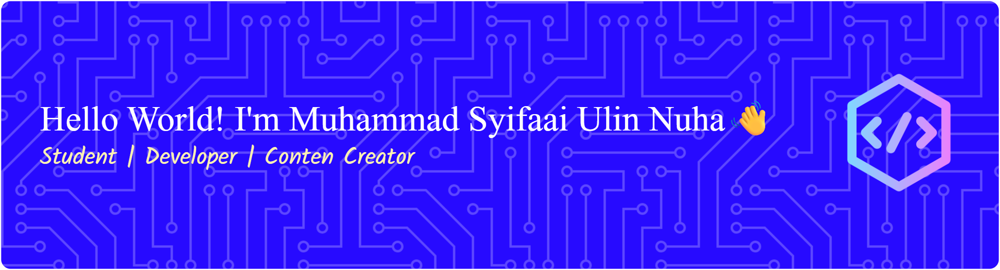

<!-- ## Hello World! I'm Muhammad Syifaai Ulin Nuha👋 -->

<!-- - 🔭 I’m currently learning on Universitas Islam Indonesia

##### Skills

##### Connect with me

 

##### My GitHub Stats

 -->

### Hello World! I'm Muhammad Syifaai Ulin Nuha 👋

##### 💻 Tech Stack:

         

##### 📊 GitHub Stats:

 
 

##### 🏆 GitHub Trophies

##### 🔝 Top Contributed Repo

---

<!-- Proudly created with GPRM ( https://gprm.itsvg.in ) -->
<picture>
  <source media="(prefers-color-scheme: dark)" srcset="https://raw.githubusercontent.com/syifaaiulinnuha/syifaaiulinnuha/pacman-output/pacman-contribution-graph-dark.svg">
  <source media="(prefers-color-scheme: light)" srcset="https://raw.githubusercontent.com/syifaaiulinnuha/syifaaiulinnuha/pacman-output/pacman-contribution-graph.svg">
  
</picture>

###

###
